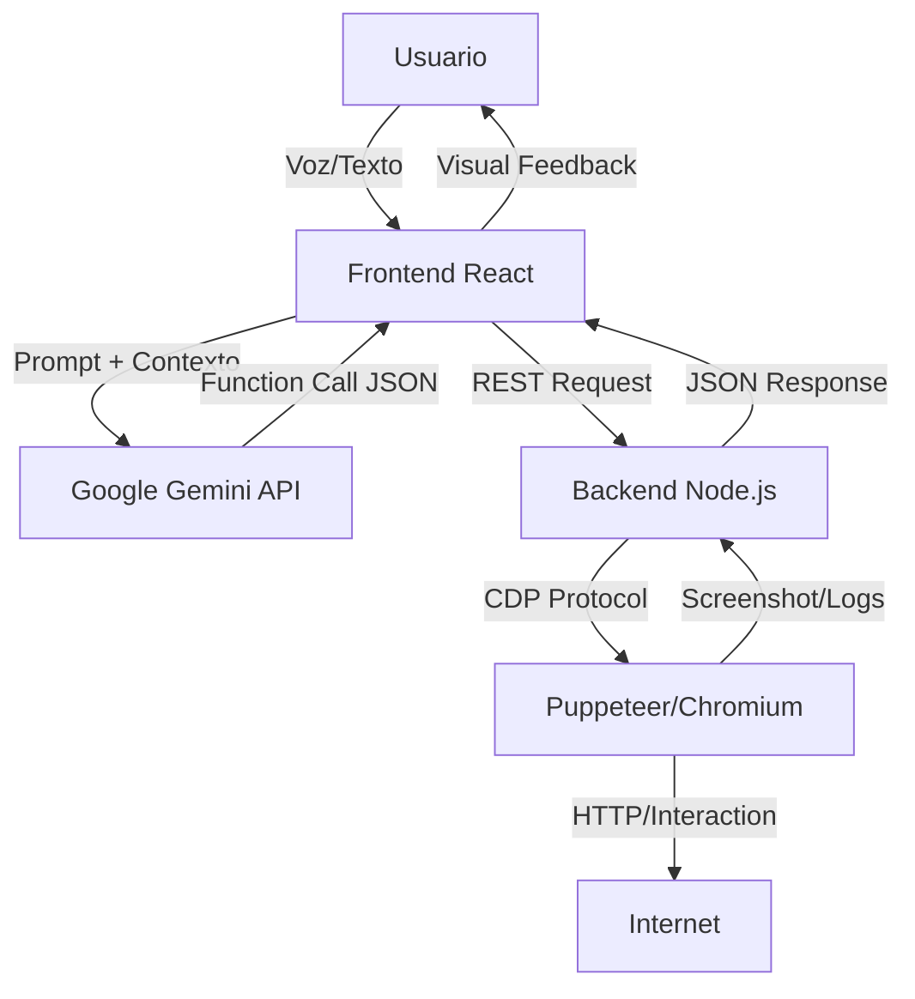

# 🛠️ Documentación Técnica: AUTONOBOT v2.7

Este documento detalla la arquitectura interna, el flujo de datos y la implementación técnica de las funciones del sistema AUTONOBOT.

---

## 1. Arquitectura del Sistema

AUTONOBOT utiliza una arquitectura **Desacoplada (Decoupled Client-Server)** para superar las limitaciones de seguridad de los navegadores web estándar (CORS, X-Frame-Options).

### Diagrama de Componentes



### 1.1 Frontend (Centro de Mando)
*   **Tecnología:** React 19 + TypeScript + Vite.
*   **Responsabilidad:** Gestión de estado, interfaz de chat, lógica del programador (Scheduler), síntesis de voz y comunicación con la IA.
*   **Renderizado:** Utiliza `window.requestAnimationFrame` implícito vía React para actualizaciones suaves de la interfaz (efectos de niebla, logs).

### 1.2 Backend (Motor de Acción)
*   **Tecnología:** Node.js + Express + Puppeteer.
*   **Responsabilidad:** Ejecución física de comandos en una instancia "Headless" de Chrome.
*   **Aislamiento:** Cada perfil de usuario genera un contexto de navegador aislado con persistencia en disco.

---

## 2. Explicación Técnica de Funciones

### 2.1 Motor de Navegación Real (Puppeteer Core)
A diferencia de las soluciones basadas en `iframe`, este sistema controla un proceso de Chrome real.
*   **Archivo:** `server/index.js` -> `initBrowser()`
*   **Persistencia:** Se utiliza la bandera `userDataDir` apuntando a `server/user_data/[profile_id]`. Esto garantiza que las cookies, `localStorage` y sesiones autenticadas sobrevivan a reinicios del servidor.
*   **Evasión de Bot:** Se lanzan argumentos como `--no-sandbox` y `--disable-setuid-sandbox` para compatibilidad en entornos Linux/Docker.

### 2.2 Interacción con el DOM (Acciones)
La IA no interactúa "visualmente" (coordenadas X,Y) sino "semánticamente" (Selectores CSS).
*   **Endpoint:** `POST /action`
*   **Lógica de Clic:**
    1.  Intenta `page.click(selector)` nativo de Puppeteer.
    2.  **Fallback:** Si falla (por superposiciones), inyecta JavaScript (`document.querySelector(...).click()`) directamente en el contexto de la página (`page.evaluate`).
*   **Escritura Humana:** `page.type` simula pulsaciones de teclas con retardos aleatorios leves para evitar bloqueos anti-bot.

### 2.3 Sistema de Visión Remota (Streaming)
Para que el usuario "vea" lo que hace el robot sin WebRTC complejo:
1.  Después de cada acción (`navigate`, `click`), Puppeteer toma una captura (`page.screenshot`).
2.  La imagen se codifica en **Base64**.
3.  Se envía en el cuerpo de la respuesta JSON al frontend.
4.  El componente `BrowserPanel.tsx` renderiza esta imagen, creando una sensación de video a bajos FPS (suficiente para automatización).

### 2.4 Programador de Tareas (Scheduler Engine)
*   **Implementación:** `App.tsx` -> `useEffect` con `setInterval`.
*   **Lógica:**
    *   El bucle se ejecuta cada 10 segundos.
    *   Compara la hora del sistema (`HH:mm`) con el array `tasks` del perfil activo.
    *   **Debounce:** Verifica la propiedad `lastRun` para evitar ejecuciones múltiples en el mismo minuto.
    *   **Disparador:** Inyecta un mensaje simulado del usuario en el chat (`handleSendMessage`), activando el flujo normal de la IA.

### 2.5 Sistema de Descargas
*   **Protocolo CDP:** Se utiliza `Chrome DevTools Protocol` para configurar el comportamiento de descarga:
    ```javascript
    client.send('Page.setDownloadBehavior', { behavior: 'allow', downloadPath: ... })
    ```
*   **Gestión de Archivos:** El backend expone un endpoint `/downloads` que lee el sistema de archivos (`fs.readdirSync`) y devuelve la lista a la IA, permitiéndole "ver" qué ha descargado.

---

## 3. Integración con Inteligencia Artificial

### 3.1 Modelo y Configuración
*   **Modelo:** `gemini-2.5-flash` (Optimizado para latencia y Function Calling).
*   **Service:** `services/geminiService.ts`.

### 3.2 Bucle de Razonamiento (ReAct Loop)
El sistema implementa un patrón de Agente Autónomo:
1.  **Pensamiento:** La IA recibe el historial y el input.
2.  **Decisión de Herramienta:** La IA decide llamar a `navigate` o `click`.
3.  **Interrupción:** El script `generateResponse` detecta `functionCalls`.
4.  **Ejecución:** Se llama a la función TypeScript correspondiente (que llama al backend).
5.  **Observación:** El resultado (éxito/error/screenshot) se devuelve a la IA.
6.  **Recursividad:** El proceso se repite hasta que la IA genera una respuesta de texto final.

---

## 4. Seguridad y Permisos

*   **API Key:** Se gestiona estrictamente vía `process.env` y nunca se expone al cliente final en producción (aunque en esta demo corre local).
*   **Aislamiento de Archivos:** El backend restringe el acceso de lectura/escritura únicamente a las carpetas `user_data` y `downloads`, preveniendo acceso al sistema operativo anfitrión.
*   **Sandboxing:** Puppeteer ejecuta las páginas web en procesos aislados del sistema operativo.
